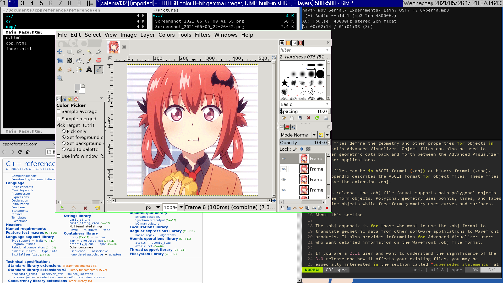

# Inugami-dev64's comfy AESTHETIC dwm build

This dwm build includes some additional patches and fonts. The color scheme 
is made to be similar to classical Windows theme. For full AESTHETIC 
experience I recommend using Chicago95 theme for GTK applications.

## Keybindings

### General

* Super + Left / Right - change window focus  
* Super + Enter - switch window zoom  
* Super + b - toggle statusbar
* Super + g - toggle window float mode  
* Super + Shift + c - kill client
* Super + [ - focus on previous monitor  
* Super + ] - focus on next monitor  
* Super + j / k - increment / decrement master stacking

### Floating window resizing

Window resizing can be done using mouse by clicking Super and then dragging the window
while holding right click, or via following shortcuts:  

* Super + Control + h - make window 40px horizontally smaller  
* Super + Control + j - make window 40px vertically bigger  
* Super + Control + k - make window 40px vertically smaller  
* Super + Control + l - make window 40px horizontally bigger  

### Window moving

Windows can be moved using Super + mouse dragging or via following shortcuts:  

* Super + Shift + h - move window 40px left
* Super + Shift + j - move window 40px down
* Super + Shift + k - move window 40px up
* Super + Shift + l - move window 40px right

### Program specific

* Super + Period - volume up (requires pamixer)  
* Super + Comma - volume down (requires pamixer)  
* Super + r - run program (requires dmenu)
* Super + Shift + Enter - spawn new terminal window (requires st)  
* Super + i - open webbrowser (requires Firefox)  
* Super + f - open file manager (requires vifm)  
* Super + p - open process manager (requires htop)
* Super + s - new screenshot (requires xfce4-screenshooter)
* 
